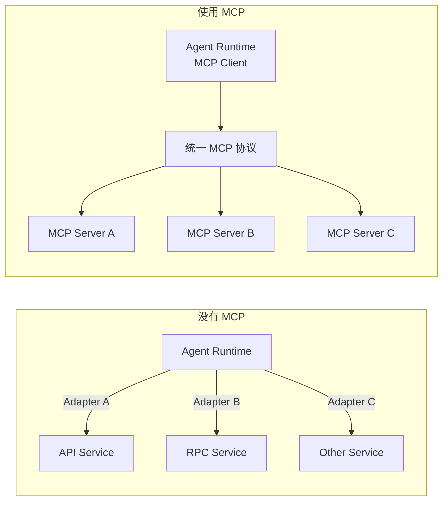
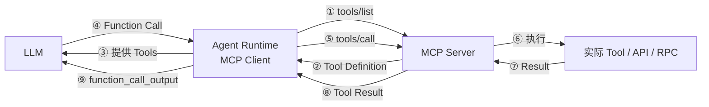
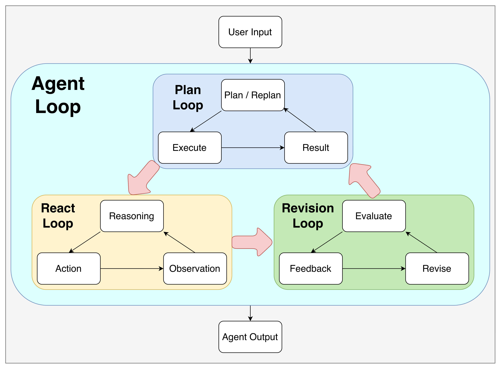

# Harness

## Agent

### LLM VS Agent

LLM 是一种根据输入 Context 预测并生成后续 Token 的**大语言模型**，而 Agent 则是将 LLM 结合 Tool 和 Runtime 等工程能力构成的**执行系统**。像 GPT、Claude、Doubao、Qwen 等是 LLM，而 Codex、Claude Code、Trae、Qoder 等才是 Agent。

需要明确的是，LLM 的输出既可以表现为**自然语言内容**，也可以表现为**结构化数据**，前者能够让 Agent 与用户实现真正意义上的对话沟通，但后者才是让 Agent 能够执行可靠行动并体现 AI 的关键。这是因为**结构化输出可以被代码按照固定 Schema 解析成明确的函数名称与传入参数**，从而通过**函数调用**的方式让 AGENT **执行一切可被编码的操作**。

可以类比理解为：**LLM = 大脑，Tool = 工具，Runtime = 身体，Agent = 人类**；人类可以通过大脑指挥身体来使用工具完成任务 = Agent 可以通过 LLM 指挥 Runtime 使用 Tool 完成任务。

### Model Call

对 Agent 来说，LLM 就是自己的决策引擎，Agent 的运行过程本质上由一次次 Model Call 驱动，它会根据当前环境信息，按照模型厂商定义的接口协议，编码成结构化 Request 发送给 LLM，再把 LLM 返回的结构化 Response 解析成回复文本和执行动作。

从工程底层看，一次 Model Call 本质上就是一次 HTTP 请求。以 OpenAI 当前的 Responses API 的 `/v1/responses` 为例
- 请求侧的核心字段：
	- `model`：指定本次调用使用哪个模型。
	- `instructions`：提供高优先级指令，用于规定模型的身份、目标、行为原则和执行约束。
	- `input`：一组结构化 `Input Item`，描述本轮模型需要处理的任务内容、对话历史和执行历史。
	- `tools`：声明本轮允许模型使用哪些 Tool，以及对应的调用 Schema。
- 响应侧的核心字段：
	- `usage`：记录本次 Model Call 消耗的 Token 等资源信息。
	- `output`：一组结构化 `Output Item`，提供模型本轮产生的自然语言回复、推理状态以及动作决策。

对于 `Input Item` 和 `Output Item`，两者之间存在天然的循环关系：模型当前一轮产生的部分 Output Item，会在下一轮重新作为 Input Item 提供给模型。

**User Message**：用户对模型说过什么
```json
{
  "type": "message",
  "role": "user",
  "content": [
    {
      "type": "input_text",
      "text": "总结这个 PDF"
    }
  ]
}
```

**Assistant Message**：模型对用户说过什么
```json
{
  "type": "message",
  "role": "assistant",
  "content": [
    {
      "type": "output_text",
      "text": "我需要先读取 Main.java。"
    }
  ]
}
```

**Function Call**：模型决定调用什么工具
```json
{
  "type": "function_call",
  "call_id": "call_123",
  "name": "read_file",
  "arguments": "{\"path\":\"Main.java\"}"
}
```

**Function Call Output**：调用工具的结果
```json
{
  "type": "function_call_output",
  "call_id": "call_123",
  "output": "public class Main { ... }"
}
```

**Reasoning**：模型生成的推理摘要
```json
{
  "type": "reasoning",
  "id": "rs_123",
  "summary": [
    {
      "type": "summary_text",
      "text": "需要继续检查项目配置。"
    }
  ]
}
```

### Function Call

LLM 本身不会直接执行本地函数，也不具备读写硬盘、执行命令、访问数据库等能力。它能够做的是根据当前 Context 和 Runtime 提供的 Tool Definition，选择一个合适的 Tool，并生成符合 Schema 的调用参数，**以结构化数据的形式表达自己的行动意图**，这种形式就叫做 Function Call。

Function Call 会由 Runtime 读取和解析，会根据 `name` 找到真正的 Tool Interface，然后根据 `arguments` 传递参数并执行函数，最后将执行结果作为 `function_call_output` 发送回 LLM。也就是说，**LLM 负责的是理解需求 → 选择工具 → 生成调用参数，而 Runtime 才真正负责函数调用**。
```python
for (ResponseOutputItem item : response.output()) {
    if (item.isMessage()) {
        // send text
    }
    else if (item.isFunctionCall()) {
        // execute tool
    }
}
```

### Hierarchy

从工程视角看，一次 Agent 的持续交互可以拆成几个不同粒度的运行与观测单元：

| 概念      | 含义      | 定义                                | 作用                                            | 关系                  |
| ------- | ------- | --------------------------------- | --------------------------------------------- | ------------------- |
| Session | 一次持续会话  | 表示用户与 Agent 的一段持续交互的会话范围          | 保存和恢复 Conversation History，让不同 Run 之间保持上下文连续性 | 一个 Session 包含多个 Run |
| Run     | 一次智能体交互 | 从接收到一次新的用户输入开始，到返回最终结果、暂停、失败或中断为止 | 通过 Agent Loop 串联多个 Turn，持续推进当前任务              | 一个 Run 包含多个 Turn    |
| Turn    | 一次模型决策  | 表示 Runtime 的一次 Model Call         | 将 Context 传给 LLM 获取新的决策判断和行为指示                | 一个 Turn 包含多个 Span   |
| Span    | 一次执行操作  | 表示 Runtime 的一次 Function Call      | 作为基本观测单元，用于记录某个具体运行操作                         | /                   |

以运行时间轴的视角来看
```
Session
│
├── Run #1
│   │
│   ├── Turn #1: Model Call
│   │   ├── Span: Tool Execution
│   │   └── Span: Tool Execution
│   │
│   ├── Turn #2: Model Call
│   │   ├── Span: Tool Execution
│   │   └── Span: Tool Execution
│   │
│   └── Turn #3: Model Call
│
└── Run #2
    │
    ├── Turn #1: Model Call
    │   ├── Span: Tool Execution
    │   └── Span: Tool Execution
    │
    └── Turn #2: Model Call
```

## Tool Engineering

### Tool

Tool 本身是一个能力抽象。对开发者来说，它对应代码中已经实现好的**函数接口**；但对 LLM 来说，它对应的是一份描述该能力如何使用的**结构化 Tool Definition**。
```json
{
  "type": "function",
  "name": "read_file",
  "description": "Read text content from a file.",
  "parameters": {
    "type": "object",
		"required": ["path", "offset", "limit"],
    "additionalProperties": false,
    "properties": {
      "path": {
        "type": "string",
        "description": "Path of the file to read."
      },
      "offset": {
        "type": "integer",
        "description": "Starting offset."
      },
      "limit": {
        "type": "integer",
        "description": "Maximum amount of content to read."
      }
    }
  },
  "strict": true
}
```

代码会把预先注册好的 Tool Definition 汇总起来，在运行时与用户输入一起发给 LLM，LLM 根据当前 Context 和 Tool Definition，判断**是否需要使用工具、使用哪个工具，以及应该传递哪些参数**。
```python
{
  "model": "gpt-5.6",
  "instructions": "你是一个高级后端开发程序员。",
  "input": [
    {
      "role": "user",
      "content": "请你告诉我这个程序的功能是什么？"
    }
  ],
  "tools": [
    { ToolDefinition1 },
    { ToolDefinition2 }
  ]
}
```

### MCP

之前说过，Tool 的调用完全依赖 Agent Runtime 对 Function Call 的解析与执行，真正的函数实现过程对 LLM 是**透明**的。因此，一个 Tool 的底层实现并**不一定是本地函数，也可以是 API、RPC 或其他任何外部服务**。

这里就产生了一个问题：这些外部服务最初**并不是按照 LLM 所需要的 Tool Definition 形式设计**的。如果没有统一协议，Agent Runtime 想接入不同服务，就需要分别编写适配代码，将各自的接口描述转换成 Tool Definition，并处理不同的调用方式。所以 MCP（Model Context Protocol，模型上下文协议）就是为了解决这类**标准化接入问题**而出现的，它定义了一套统一的客户端与服务端交互协议，使外部服务能够按照统一格式暴露自己的能力，从而让 Agent Runtime 可以通过一套通用的 逻辑接入不同的 MCP Server，而不必为每个服务重新设计一套工具发现和调用流程。


在这一过程中，Agent Runtime 被当作 **MCP Client**，它首先通过 `tools/list` 向 MCP Server 查询其提供的工具，获得工具的 `name`, `description`, `inputSchema` 等信息，再将这些信息适配成模型能够使用的 Tool Definition 提供给 LLM。当 LLM 输出对应的 Function Call 后，Agent Runtime 会识别出该 Tool 来自 MCP Server，并将这次调用转换成 MCP 的 `tools/call` 请求发送给对应的 Server。MCP Server 完成实际执行后返回结果，Agent Runtime 再将结果作为 Tool Output 提供给 LLM。


### CLI

除了 MCP 这类外部服务之外，Agent 还可以直接使用**本地环境中已经安装的命令行程序 CLI**，例如 `git`、`grep`、`npm` 等。但是 Agent Runtime 不会把每一个 CLI 都注册成独立的 Tool Definition，因为 CLI 的数量非常多，而且一个 CLI 内部往往还包含大量 Commands 和 Options，如果全部展开成 Tool，会**占用大量上下文**。所以，常见的做法是只提供一个通用的 **Shell Tool**，其核心参数就只有**命令字符串** `command`，由 Agent Runtime 负责**在本地 Shell 中执行**。
```json
{
  "type": "function",
  "name": "run_command",
  "description": "Execute a command in the local shell.",
  "parameters": {
    "type": "object",
    "properties": {
      "command": {
        "type": "string",
        "description": "The shell command to execute."
      }
    },
    "required": ["command"],
    "additionalProperties": false
  },
  "strict": true
}
```

对于 `git`、`ls` 等常见 CLI，LLM 由于训练数据覆盖充分，通常已经具备一定的使用知识。但对于用户自行开发的 CLI、公开但冷门的 CLI，或者不同版本之间存在参数差异的 CLI，单纯依赖模型已有知识并不可靠。因此还需要一种方式动态获取 CLI 的实际使用说明，大多数 CLI 都会提供类似 `--help` 的帮助入口，它不像 MCP 一样通过统一协议暴露机器可读的 Tool Definition，而通常是直接通过 `stdout` 输出**自然语言形式的文本化接口说明**，核心内容包括 `Usage`, `Description`, `Commands`, `Arguments`, `Options`, `Examples`，供 LLM 理解后构造命令字符串。
```plaintext
Usage:
  mycli [command] [options]

Description:
  A command-line tool for managing projects.

Commands:
  init        Initialize a new project
  build       Build the current project
  deploy      Deploy the project
  config      Manage configuration

Options:
  -h, --help        Show help information
  -v, --verbose     Enable verbose output
  --version         Show version information

Examples:
  mycli init
  mycli build --verbose
  mycli deploy
```

### MCP VS CLI

| 对比维度  | CLI                                                    | MCP                                                                             |
| ----- | ------------------------------------------------------ | ------------------------------------------------------------------------------- |
| 本质    | **命令行程序的执行接口**，通过 Shell 调用命令                           | **标准化工具接入协议**，统一 Tool 的发现、描述与调用方式                                               |
| 工具注册  | 只需要提供一个 `run_command(command)` 的 Shell Tool Definition | MCP Server 暴露多个具体 Tool，Runtime 再将其适配为对应的 Tool Definition                        |
| 工具发现  | 依赖模型已有知识，并可通过 `--help` 或 prompt 的方式动态获取使用说明            | Agent Runtime 作为 MCP Client 通过 `tools/list` 动态获取 MCP Server 提供的 Tool Definition |
| 工具调用  | Agent Runtime 启动 Shell / Process，执行具体命令                | Agent Runtime 作为 MCP Client 通过 `tools/call` 发送调用请求给 MCP Server                  |
| 上下文成本 | 低：CLI 使用说明可以由 LLM 动态按需查询                               | 高：MCP 把所有的 Tool Definitions 发给 LLM 来选择                                          |
| 组合能力  | 强：Shell 原生支持管道、重定向、脚本等机制，可以在一次执行中完成多个操作和数据传递           | 低：多个独立 Tool 通常需要多次调用，而且数据可能还需要经过 LLM 中转                                         |
| 调用延迟  | 低：本地 CLI 执行非常迅速                                        | 高：`stdio` 可以很快，但是 `http` 会收到网络延迟影响                                              |
| 错误概率  | 高：模型需要自己思考如何生成命令字符串                                    | 低：明确的 Tool Schema 可以约束参数结构和调用方式                                                 |
| 安全风险  | 高：能通过 Shell 能够执行任意 CLI，从而访问任意文件和执行任意操作                 | 低：只允许按照规定 Schema 执行暴露的 Tool，而且不一定在本机执行                                          |
| 开发成本  | 低：只需要提供可安装的 CLI，Agent 即可通过 Shell 使用                    | 高：需要实现并维护 MCP Server 来提供服务                                                      |

## Loop Engineering

### ReAct

**ReAct = Reasoning + Acting**，即“推理+行动”，是从 LLM 生成内容走向 Agent 动作执行的重要理论范式之一。它不再要求模型仅根据初始输入一次性推导最终答案，而是把 **Reasoning（为什么做），Action（如何做），Observation（做得怎么样）** 完美地交错组织起来：
1. 根据当前 Context，产出对当前任务状态的 Reasoning 和下一步的 Action
2. 通过 Action 与外部环境交互，获取新的 Observation
3. 基于最新的 Observation，重新推理和决策
4. 回到 1，形成持续反馈的闭环
```plaintext
Context
→ Reasoning
→ Action
→ Observation
→ Reasoning
→ Action
→ Observation
→ ...
→ Final Answer
```

ReAct 最重要的价值**并不是让模型想得更远，而是通过让推理能够被真实的外部反馈不断校正，使 Agent 能够根据执行结果动态调整原有判断和行动路径，从而想得更准确和更正确**。ReAct 本质上是一种推理与行动的编排范式，它本身不规定具体的工程实现，但可以自然地映射到现代的 Model Call 与 Agent Loop：Model Call 负责完成一轮 Reasoning / Action，Agent Loop 则负责把多次 Model Call 和 Observation 持续串联起来。
```plaintext
Reasoning ←→ Assistant Message
Action ←→ Function Call
Observation ←→ Function Call Output

Model Call
    ↓
Function Call + Assistant Message
    ↓
Function Call Output
    ↓
Model Call
    ↓
Function Call + Assistant Message
    ↓
...
    ↓
Final Answer
```

### Plan-and-Execute

Plan-and-Execute 从字面上理解就是“先规划，再执行”，同样属于 Agent 推理与行动的一种典型编排范式。它将全局规划和局部执行显式拆分：先由 Planner 从整体目标出发，将复杂任务拆解成一组具有**先后顺序和依赖关系**的 SubTasks，再由 Executor 按照计划逐步完成每一个 Step。

这种模式尤其适合复杂、长链路任务。它的核心价值在于让 Agent 在执行具体步骤之前先建立一张全局路线图，从而**持续维持目标、顺序和依赖关系的一致性**，避免 ReAct 中可能出现的“**每一步看起来都合理，但最终整体方向逐渐偏离**”的问题。
```plaintext
Goal
 ↓
Plan
 ├── Step 1
 ├── Step 2
 └── Step 3
 ↓
Execute Step 1
 ↓
Execute Step 2
 ↓
Execute Step 3
 ↓
Final Answer
```

但单纯的 **Plan Once** 的设计过于僵化，因为初始规划只能建立在任务开始时已经掌握的信息之上。随着实际执行推进，可能出现初始信息不完整、外部环境发生变化、某一步执行失败、发现更优路径，或者实际中间产物与原先预期不一致等情况，使最初制定的后续计划失效。

因此实际工程中通常会进一步引入 **Replanning**，即 Executor 每完成一个 Step 后由 Runtime 获取对应的 Observation，并重新评估当前 Plan 是否仍然有效。如果原计划仍然成立，就继续执行下一步；如果新的信息已经改变了任务条件，就由 Planner 基于当前最新状态重新**调整、删除、增加或重排**后续 Steps，再继续执行。
```plaintext
Goal
 ↓
Planner
 ↓
Plan
 ↓
Executor
 ↓
Observation
 ↓
Plan Still Valid?
 ├── Yes
 └── No → Replan
 ↓
Execute Next Step
```

### Revision

Revision 严格来说并不是一套完整的 Agent 执行流程，而是一种围绕结果质量进行**迭代修正**的通用机制。它关注的核心问题是：**当前模型产出的结果是否正确、完整，并且已经达到可交付标准**。因此，Revision 通常会在初始结果生成之后增加一层：
1. 先通过 Reviewer 做一次Evaluate / Critique，检查初始结果中存在的错误部分或可优化部分；
2. 生成对应的 Feedback，例如问题原因、风险点和改进建议，交给 Reviser / Refiner 修改结果；
3. 将修改后的新结果再次进入 Reviewer，由此形成持续迭代的质量闭环，直到结果满足预设质量标准。
```plaintext
Generate
   ↓
Evaluate / Critique
   ↓
Fail
   ↓
Feedback
   ↓
Revise / Refine
   ↓
Evaluate / Critique
   ↓
Pass
   ↓
Final Answer
```

Revision 中实现 Evaluate / Critique 来产生的 Feedback 的方式可以有很多种。最简单的是让模型进行 Self-Evaluation，也就是由 LLM 自己审查自己的输出，但这种方式存在明显局限：模型可能受到**原有推理路径和认知偏差**影响，无法真正识别自己的错误，甚至在多轮修改后仍然停留在局部最优。因此，在能够进行确定性验证的场景中，通常会优先引入**外部 Validator，例如代码编译、单元测试、Lint、Schema 校验、正则匹配、数值计算等**，让 Agent 获得明确的 `Pass / Fail` 或错误信息，而不是完全依赖模型自身的主观判断。

对于无法通过确定性规则直接验证的复杂任务，还可以通过 **SubAgent** 的方式，将待审查产物交给具备特定 Review Prompt、Skill 或 Tool 的 Reviewer Agent，由独立 Agent 输出审查结论和改进建议，从而将 Generation 与 Evaluation 的职责显式分离，减少主 Agent 既当“选手”又当“裁判”所带来的自我确认偏差。另一种方式是引入 **HITL**，将当前变更、关键差异总结为人类可以快速理解的自然语言内容，并主动暂停当前执行流程，将最终审查权交还给用户，由用户显式给出 Approve、Reject 或修改意见后，Runtime 再根据人工反馈继续后续 Revision 或正式执行。

### Agent Loop

虽然上述三个 Pattern 的核心思想和关注重点不同，但它们并不存在明显的替代或互斥关系，反而具有很强的互补性。在实际生产中，通常会将它们嵌套到不同层级的 Loop 中，最终共同组成一个完整的 Agent Loop。

| Pattern              | 核心想法       | 核心 Loop                                 | 优势               | 劣势                                      |
| -------------------- | ---------- | --------------------------------------- | ---------------- | --------------------------------------- |
| **ReAct**            | 下一步应该做什么   | Reason → Act → Observe → Reason         | 可以根据实时反馈动态调整行为   | 容易出现绕路、走偏、重复甚至死循环                       |
| **Plan-and-Execute** | 整个任务应该怎么完成 | Plan → Execute → Observe → Replan       | 保持全局目标、顺序和依赖关系一致 | 初始计划可能建立在错误或不完整信息上，而且规划本身也会增加成本         |
| **Revision**         | 当前产物是否足够好  | Generate → Evaluate → Feedback → Revise | 能够显著提升结果正确性和交付质量 | 评估必须和需求完全对齐，不然给出的建议也是不可靠甚至有害的，甚至会出现无限返修 |

Loop Engineering 就是在此基础上进一步抽象出来的工程思想，它关注的不再是某一种固定 Pattern，而是**如何设计 Agent 的循环，确保任务能够在有限的时间和有限的预算内持续迭代，并最终收敛到可靠正确的完成状态**。换句话说，就是**让 Agent 重复执行某个工作周期，直到满足某个 Stop Condition**。



## Runtime Engineering

### Agent Runtime

Runtime 是承载和执行 Agent 的**宿主系统**。LLM 本质上只负责接收输入并生成输出，而 Agent 狭义上来讲上也只是 Prompts + Tools + Models 的结合体，只有 Runtime 真正解决了将大模型变成应用的工程问题：
- **单轮输入应该如何组织，才能让模型准确理解当前上下文？**
- **单轮输入应该如何解析，才能让工具调用更加稳定和安全？**
- **多轮交互应该如何编排，才能持续推进任务进行？**
- **执行过程该如何加入切点，才能让行为可切入？**
- **执行过程该如何加入断点，才能让行为可控制？**
- **执行过程该如何加入埋点，才能让行为可记录？**

Runtime 真正的核心价值就在于把多轮独立的 LLM 调用组织成一个持续运行的系统，否则 LLM 就只是一个单纯的“输入 → 输出”函数，而 Agent 就只能做一轮交互。概括来说，**LLM 负责的是 Decide，Agent 负责的是 Act，而 Runtime 负责的是 Orchestrate**。

### Tool Execution

### Error Handling

### Guardrails

### Human In The Loop

### Handoffs

### Subagent

### Context Management

### State Management

### Sessions Management

### Lifecycle Hooks

### Streaming Events

### Tracing

如果把 Orchestrate 拆解，可以总结为以下关键能力：
- **Tool Execution**：负责把 LLM 输出的 `name + arguments` 映射到真实的 Tool，完成工具定位 → 参数解析 → Schema 校验 → 实际执行，并将执行结果重新包装为 Tool Output 返回给模型。它是连接“模型决策”与“真实行动”的执行桥梁，使 Function Call 最终能够转化为对本地函数、CLI、MCP 或其他外部能力的实际调用。
- **Error Handling**：负责处理模型调用失败、工具不存在、参数错误、工具执行异常、执行超时、Guardrail 拦截等各种运行时故障。一方面通过异常捕获、Retry、Timeout、Fallback 等机制避免局部故障直接导致整个 Agent Run 非预期终止；另一方面可以将部分可恢复错误转换为 Observation 返回给 LLM，使模型理解失败原因并在下一轮重新规划和修正调用。它的核心不是“保证永不失败”，而是让失败可识别、可控制、可恢复。
- **Guardrails**：负责在关键执行边界对输入、输出和工具行为进行确定性的验证，是 Agent Runtime 的自动检查与行为约束机制。当检查不通过时，可以阻止流程继续，要求模型重新生成或者转入人工处理。其核心意义在于：仅依靠 Prompt 告诉模型“不要做某事”并不能形成可靠的安全边界，关键业务规则必须通过确定性的程序逻辑建立真正的检查点。
- **Human In The Loop**：负责在 Agent 的自动执行流程中插入人工决策节点。它首先用于划定明确的自主执行边界：对于删除数据、发送邮件、执行支付、修改生产环境等高风险操作，不应该完全依赖模型自行决定，而是暂停当前 Run，将待执行操作及必要上下文暴露给人，由人选择 `Approve` 或 `Reject`。除此之外，HITL 也可以用于关键方案和路径决策，也就是说当任务存在多个合理方案、较强主观偏好或不可逆决策时，Agent 可以主动暂停，将最终决策权交还给人，再根据人工选择继续执行，从而降低自主判断与用户真实预期之间的偏差。
- **Handoffs**：负责将当前任务的控制权从一个 Agent 转移给另一个 Agent，常见原因包括：1️⃣ 当前任务已经超出当前 Agent 的职责或专业领域，需要交给更合适的专家 Agent；2️⃣ 当前 Agent 缺少任务所需的 Tool、权限或专业能力，而另一个 Agent 具备这些条件；3️⃣ 当前 Agent 本身只承担路由、分诊、需求澄清或方案设计的职责，后续阶段需要由执行 Agent 接管。
- **Subagent**：负责将一个可以相对独立完成的子任务委托给另一个 Agent，但当前 Agent 仍然保留整体任务的控制权。主 Agent 只需要向 Subagent 提供目标和必要上下文，不需要了解其内部具体如何推理和执行，待 Subagent 返回结果后，再将结果整合进自己的 Context，继续完成整体任务。因此可以把它理解为 Agent as Tool，典型场景包括并行调研、代码分析、信息查询、专项审查、独立验证等。
- **Context Management**：负责管理 Runtime 当前掌握的上下文，并决定其中哪些信息应该真正进入 LLM 的 Context Window。它既要保证模型获得足够的背景信息、历史执行结果和当前任务状态，从而做出正确的下一步决策，又要控制 Token 消耗、隐藏敏感信息、移除过期内容和无关噪声，使输入始终保持较高的信息密度。
- **Sessions Management**：负责跨 Turn / 跨 Run 的会话连续性，通过保存和恢复 Conversation History，使新的模型调用能够继承此前用户输入、模型回复以及必要的工具调用历史。它解决的是“过去发生过什么”的持久化问题，使原本相互独立的模型调用能够在语义、内容和逻辑上形成连续的长期会话。
- **State Management**：负责维护当前 Agent Run 的运行现场，包括原始输入、当前 Agent、当前 Turn、已经产生的 Model Response、Tool Result、Approval 状态、Guardrail 结果等信息。它本质上是一份可以持续更新，必要时可以序列化和恢复的运行状态快照，使 Runtime 能够判断当前任务执行到了哪里，以及下一步应该继续执行、暂停、恢复、Handoff 还是结束。
- **Lifecycle Hooks**：负责在 Runtime 的关键生命周期节点挂载额外的横切逻辑，而不需要侵入 Agent Loop 和具体业务代码。其思想与传统后端中的 Middleware / AOP 很接近，可以在 LLM 调用前后、Tool 执行前后、Agent 启动结束、Handoff 等节点统一完成 Logging、Metrics、Monitoring、Audit、Billing 等逻辑，使通用基础能力与 Agent 的核心执行逻辑解耦。
- **Streaming Events**：负责将 Agent 的执行过程以事件流的方式实时暴露给上层应用，而不是等待整个 Run 完成后一次性返回结果。用户或前端可以持续收到文本生成、Tool Call、Tool Result、Handoff、状态变化等可公开的执行事件，从而知道 Agent 正在想什么和正在做什么。它一方面能够显著提升用户的交互体验，另一方面也能让用户可以根据实时进度及时补充信息或调整后续指令。
- **Tracing**：负责将一次 Run 从开始到结束的动态执行过程按照时间关系和父子调用关系完整记录下来。一次完整任务通常表示为一个 Trace，其中包含多个 Span，每个 Span 对应一个具体运行操作。Tracing 的核心价值不是单纯“记录日志”，而是还原 Agent 为什么会沿着这条路径执行到当前结果：开发者可以据此定位哪一轮模型决策错误、哪个 Tool 参数频繁异常、哪个步骤耗时过长、Token 消耗集中在哪里，是给 Agent 做 Debug 和 Evaluation 的重要数据基础。

## Context Engineering

### Memory


### RAG

