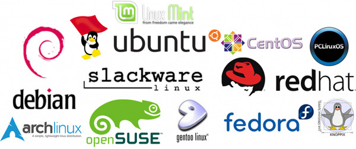
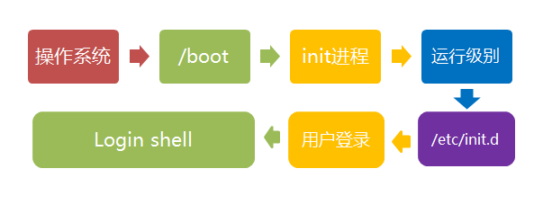
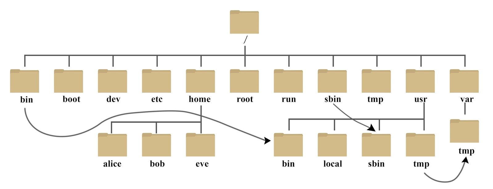
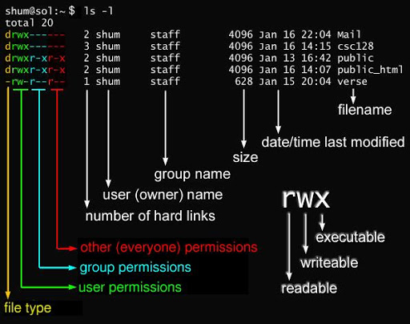

# Linux


   * [Linux 介绍](#linux-介绍)
      * [什么是 Linux](#什么是-linux)
      * [组成](#组成)
      * [开机](#开机)
      * [命令元知识](#命令元知识)
   * [Linux 文件/目录管理](#linux-文件目录管理)
      * [系统目录介绍](#系统目录介绍)
      * [查看目录内容：ls](#查看目录内容ls)
      * [查看目录路径：pwd](#查看目录路径pwd)
      * [切换目录路径：cd](#切换目录路径cd)
      * [创建目录：mkdir](#创建目录mkdir)
      * [销毁目录/文件：rm](#销毁目录文件rm)
      * [复制目录/文件：cp](#复制目录文件cp)
      * [更新文件：touch 和 mv](#更新文件touch-和-mv)
   * [Linux 文本处理](#linux-文本处理)
      * [文本显示：cat、less/more、head/tail](#文本显示catlessmoreheadtail)
      * [文本搜索：grep](#文本搜索grep)
      * [文本统计：wc、cut、uniq、sort](#文本统计wccutuniqsort)
      * [文本修改](#文本修改)
   * [Linux 用户管理](#linux-用户管理)
      * [查看用户：groups、whoami、id](#查看用户groupswhoamiid)
      * [用户操作：useradd、userdel、usermod、passwd](#用户操作useradduserdelusermodpasswd)
      * [组操作：groupadd、groupdel、groupmod](#组操作groupaddgroupdelgroupmod)
      * [将用户添加到组：gpsswd](#将用户添加到组gpsswd)
   * [Linux 权限管理](#linux-权限管理)
      * [修改权限：chmod](#修改权限chmod)
      * [修改属：chgrp、chown](#修改属chgrpchown)
      * [权限削减：umask](#权限削减umask)
   * [Linux 软件包管理](#linux-软件包管理)
   * [Linux 系统信息查看](#linux-系统信息查看)


## Linux 介绍

### 什么是 Linux

Linux 是由芬兰人林纳斯·托瓦兹（Linus Torvalds）创建的操作系统内核（kernel），遵循 POSIX 标准，并继承了 Unix 的**多用户、多任务、多线程、多 CPU 支持**等设计，并且重新实现了 Unix 的功能和 API

Linux 最常用于**服务器**，并且具有绝对的统治地位
1. **稳定**：可以持久运行，不关机不崩溃
2. **安全性高**：用户权限分明，只有超级用户（root）具有全部权限
3. **开源免费**：企业可以根据自己需求魔改系统
4. **轻量**：不需要很高的配置，没有臃肿的界面和不必要的服务
5. **自动化**：支持 shell 脚本，自动化程度高

### 组成

**Linux 发行版 = Kernel + GNU + Shell + 应用程序 + 包管理系统**（常见的有 Ubuntu、CentOS 和 Debian）



Linux 内核：负责**软件与硬件之间的交互**，调度进程、管理内存、文件系统、网络等底层资源

GNU（GNU's Not Unix）：负责**用户与内核之间的交互**，是用户操作 Linux 内核的工具集，是由 Richard Stallman 发起的一个自由软件项目，目标是开发一个完全自由、拒绝专有软件且兼容 UNIX 的操作系统，提供了各种基础命令（ls、mv、chmod 等）、编译器（GCC）、调试器（GDB）、C 标准库（glibc）、文本编辑器（nano）、构建工具（make）

Shell：负责**将文本命令转化为机器指令**，本义是外壳，又称为命令行解释器，可以自动执行一系列命令，实现任务自动化，常见的有 bash、sh、zsh 等

包管理系统（Package Manager）：负责**管理软件的安装、升级、配置和卸载**，可以通俗地理解为是 Linux 的 “AppStore”，常见的有 apt、dnf 和 pacman

应用程序：**利用内核 API 实现的各种软件**，如图形用户界面（GNOME）、网络浏览器（Firefox）、办公软件（LibreOffice）、文件浏览器、集成开发环境（VSCode）等

### 开机

过程
1. **加电开机**：运行主板上的 BIOS，进行 POST，检查内存、CPU 和硬件是否正常，并初始化基本的硬件环境
2. **引导加载器**：读取并运行硬盘上 /boot 分区中的 Bootloader，负责将 Linux 内核加载到内存中，并将控制权转移给内核
3. **内核初始化**：内核开始初始化核心组件，如内存管理、设备驱动、文件系统等，然后启动第一个用户空间进程 init/systemd
4. **设定系统级别**：init/systemd 根据配置决定系统要进入哪个 runlevel/target
5. **启动服务**：系统按照配置顺序依次启动各种服务和守护进程，例如网络管理、时间同步、日志记录、声音系统、图形界面服务等
6. **用户登录**：所有服务启动完成后，系统会提供登录界面，用户输入用户名和密码进入用户空间，可以开始正常管理系统、运行程序、执行命令等



|运行级别（runlevel）|运行目标（target）|定义|
|---|---|---|
|0|poweroff.target|关机|
|1|rescue.target|单用户模式，无网络，命令行界面，具有 root 权限，禁止远程登录，用于系统维护|
|2|multi-user.target|多用户模式，无网络，命令行界面|
|3|multi-user.target|多用户模式，有网络，命令行界面|
|4|multi-user.target|保留，供用户自定义|
|5|graphical.target|多用户模式，有网络，图形界面|
|6|reboot.target|重启|

有关的命令为：
- 切换目标
   ```shell
   sudo systemctl isolate <target>
   ```
- 获取默认目标
   ```shell
   systemctl get-default
   ```
- 切换默认目标
   ```shell
   sudo systemctl set-default <target>
   ```

### 命令元知识

命令的通用语法为
```shell
[command] [options] ([options_value]) [arguments]
```
- command：命令
- options：选项，以 `-` 或者 `--` 开头，用来指示命令的执行方式
  - 可以在一个命令中提供多个选项，如 `ls -l -a -t`
  - 有些选项是没有选项值的，而有些选项是必须提供选项值的
  - 选项值必须紧跟在对应选项后面
  - 没有选项值的选项可以合并，如 `ls -lat`
- arguments：参数，也就是命令作用的对象，可以理解为 command 就是一个函数，arguments 就是函数的传参

其中有些选项是大部分命令都支持的，注意不是全部！
- -h 或 --help：显示帮助说明
- --version：显示版本信息
- -v：显示执行过程，verbose 意味冗长的
- -f：强制执行，force
- -r 或 -R：递归执行，recursive
- -i：执行前要求用户确认，interactive

命令前缀不属于命令语法结构，而是在 shell 显示的**环境信息**，常见格式为
```shell
[username]@[hostname]:[path][symbol]
```
- username：显示当前登录用户的用户名
- hostname：表示当前机器的主机名
- path：显示当前工作目录的路径，其中 `~` 表示用户的主目录
- symbol：用于指示命令行等待输入，`$` 表示为普通用户，`#` 表示为超级用户


## Linux 文件/目录管理

### 系统目录介绍

在 Linux 中，一切都是文件，只是执行方式不同而已
- /：根目录，所有文件和目录都从这里开始
- /bin：存放系统启动和基本操作所需的核心程序和命令
- /sbin：存放仅超级用户使用的系统管理所需的核心程序和命令
- /lib：存放库文件
- /boot：存放内核和启动加载器
- /dev：存放外部设备文件，提供对硬件设备的接口
- /etc：存放系统和程序的全局配置文件
- /usr：存放用户级应用程序和文件
- /run：存放系统运行时生成的临时文件
- /var：存放经常变化的数据，如日志、缓存等
- /tmp：存放临时文件，系统重启后通常会被自动清空
- /home：存放普通用户的主目录
- /opt：存放可选的附加软件或第三方应用程序



### 查看目录内容：ls

```shell
ls [options] [dirname/filename]
```
|选项|全称|说明|
|--|--|--|
|-l|--format=long|以长格式显示，包含权限、所有者、大小、修改时间等详细信息|
|-a|--all|显示所有文件，包括隐藏文件（以.开头）|
|-h|--human-readable|文件大小以 KB、MB、GB 显示|
|-t|--sort=time|按修改时间排序，默认新文件在前|
|-r|--reverse|反转排序结果，配合-t 时让旧文件在前|
|-R|--recursive|递归显示子目录内容|

> 如果不指定目录名或文件名，则默认展示当前目录

每个文件属性按照顺序分别为：
1. 文件类型
   - \-：普通文件
   - d：目录文件，dictionary
   - l：符号链接，link
   - c：字符设备，char
   - b：块设备，block
   - s：套接字，socket
   - p：管道文件，pipe
2. 文件权限：三个为一组，每组都代表 `rwx`（readable, writeable, executable），如果存在权限则显示字母，否则显示 `-`，其中每组分别代表
   - 属主（user）：创建该文件的人
   - 属组（group）：与属主供处于同一个用户组的用户
   - 其他（others）：不在属主所处用户组的其他用户
3. 硬链接数：表示有多少个目录条目指向这个文件
4. 属主和属组：创建文件的用户名和该文件所属的用户组
5. 文件大小：单位是字节，对目录而言是 4096，对普通文件就是实际大小
6. 最后修改时间：显示月+日+时间，如果修改时间离当前时间超过半年，会显示年份替代时间
7. 文件名：就是文件或目录的名字，如果是链接，后面会有 `->` 指向目标路径



### 查看目录路径：pwd

pwd 没有参数，就是简单的查看当前的完整绝对路径

### 切换目录路径：cd

```shell
cd [path]
```
|path 形式|说明|
|--|--|
|空|切换到当前用户的主目录|
|~|切换到当前用户的主目录|
|..|返回上级目录|
|../..|返回上上级目录|
|-|返回上一次所在目录|
|/|切换到根目录|
|相对路径|进入指定的相对路径目录|
|/绝对路径|进入指定的绝对路径目录|

> Linux 路径是大小写敏感的

### 创建目录：mkdir

mkdir 就是在当前目录下创建一个子目录，如果需要创建多级目录，需要提供选项 `-p`

### 销毁目录/文件：rm

|选项|作用|
|--|--|
|无|删除文件或空目录|
|-i|交互模式，提示是否确认删除|
|-r|递归删除目录及其内容|
|-f|强制删除，不提示确认|
|-rf|递归+强制，删除一切，终极指令|

> rmdir 命令用于删除空目录，目录非空会提示失败

### 复制目录/文件：cp

```shell
cp [options] [source1 source2 ...] [destination]
```
|选项|作用|
|--|--|
|-r|递归复制目录及其内容|
|-i|交互模式，覆盖前提示确认|
|-f|强制覆盖，不提示|
|-n|禁止覆盖已有文件|
|-v|显示复制过程|
|-u|仅当源文件比目标文件新时才复制|

cp 的用法示例
```shell
cp -r dir1/ dir2/ # 复制目录
cp a.txt b.txt    # 复制文件在当前目录
cp a.txt /tmp/    # 复制文件到指定目录
cp file1 file2 file3 /backup/ # 复制多个文件到指定目录
```

> cp 允许指定多个源，但只允许指定一个目的地

### 更新文件：touch 和 mv

touch 用于**新建文件或改变文件时间戳**
```shell
touch [options] [filename]
touch newfile.txt # 创建单个空白文件
touch file{1..3}.txt # 创建多个空白文件
touch -d "2023-04-01 12:34:56" file.txt # 更改时间戳
touch -t 20230401124356 file.txt # 更改时间戳
touch -r file.txt file2.txt # 更改时间戳
```
|选项|作用|
|--|--|
|-d|指定字符串来更新，如 "2023-04-11 12:00"|
|-t|指定时间格式来更新，如 202404111200|
|-r|指定另一个文件的时间戳来更新|

mv 用于**移动文件或重命名文件**
```shell
mv [options] [filename] [newfilename/dirname]
mv file.txt /path/
mv oldname.txt newname.txt
```
|选项|作用|
|--|--|
|-i|交互模式，覆盖前提示确认|
|-f|强制覆盖，不提示|
|-n|禁止覆盖已有文件|
|-v|显示操作过程|


## Linux 文本处理

### 文本显示：cat、less/more、head/tail

cat 用于**快速显示小文件的全部内容**，也可以拼接多个文件一起输出
```shell
cat [options] [filename]
```
|选项|功能|
|--|--|
|-n|显示行号|
|-A|显示所有字符|

less/more 用于**分页查看大文件**，支持向上、向下滚动，搜索关键词，跳转到指定行，退出时不刷新终端内容
```shell
cat [filename]
```
|按键|功能|
|--|--|
|q|退出|
|Space|向下翻页|
|b|向上翻页|
|↑ / ↓|上下滚动一行|
|g|跳转到文件开头，位于顶部|
|G|跳转到文件末尾，作为底部|
|n|跳转到下一个匹配项，位于顶部|
|N|跳转到上一个匹配项，位于顶部|
|<number>g|跳转到第 number 行，位于顶部|
|/关键词|向下搜索|
|?关键词|向上搜索|
|h|显示帮助|

head/tail 用于**查看文件前/后几行**，默认为 10 行，利用选项 -n N 可以指定行数
```shell
head [options] [filename]
tail [options] [filename]
```

### 文本搜索：grep

grep 全称 Global Regular Expression Print，即全局正则表达式查找打印，用于**在文本中查找匹配内容，并把含有它的整行打印出来**
```shell
grep [options] ["pattern"] [filename]
```
|选项|说明|
|--|--|
|-i|忽略大小写|
|-n|显示行号|
|-v|反向匹配，显示不包含匹配内容的行|
|-r|递归搜索目录下的所有文件|
|-l|只显示匹配的文件名，不显示内容|
|-c|只显示匹配行的数量|
|-E|支持扩展正则表达式|

### 文本统计：wc、cut、uniq、sort

这些命令的语法都为
```shell
[command] [options] [filename]
```

wc 用于**计数文本内容，如行数、字段数、字节数**
|选项|说明|
|--|--|
|-l|统计行数|
|-w|统计字段数，以空格分隔|
|-c|统计字节数|

cut 用于**按列提取文本字段**
|选项|说明|
|--|--|
|-f|必须的，指定要提取的字段编号|
|-d|可选的，指定字段分隔符，默认为制表符|

uniq 用于去除相邻的重复行，通常配合 sort 使用
|选项|说明|
|--|--|
|-c|显示每行出现的次数|
|-d|仅显示相邻且重复的行|
|-u|仅显示相邻且不重复的行|

sort 用于对文本行进行排序，支持字典序、数字、反向等排序方式  
|选项|说明|
|--|--|
|-n|按数值排序|
|-r|反向排序（降序）|
|-u|去重排序|

### 文本修改


## Linux 用户管理

### 查看用户：groups、whoami、id

- whoami：显示当前终端登录的用户名  
- groups：显示当前用户所属的所有用户组
- id：显示 UID、GID 及所属组等详细信息

### 用户操作：useradd、userdel、usermod、passwd

这些命令的语法都为
```shell
[command] [options] [username]
```

useradd 用于**新建用户账号**
|选项|说明|
|--|--|
|-m|自动创建用户的 home 目录|
|-d|指定用户主目录，必须存在，否则要搭配 -m|
|-s|指定默认 shell，如 `/bin/bash`|
|-G|添加到附加用户组|
|-u|指定 UID|
|-d|指定 home 目录路径|
|-c|指定一段注释性描述|

passwd 用于**设置或修改用户密码** 
|选项|说明|
|--|--|
|-l|锁定口令，即禁用账号|
|-u|口令解锁|
|-d|使账号无口令|
|-f|强迫用户下次登录时修改口令|

> passwd 命令会先询问原密码，验证后再要求用户输入两遍新密码，如果两次输入的密码一致，则将这个密码指定给用户

usermod 用于**修改已有用户的设置** 
|选项|说明|
|--|--|
|-l|修改用户名|
|-s|修改默认 shell|
|-d|修改 home 目录|
|-G|修改附加组（替换原组）|
|-aG|追加附加组（不替换）|

userdel 用于**删除系统用户**  
|选项|说明|
|--|--|
|-r|连带删除 home 目录和邮件文件（若存在）|

### 组操作：groupadd、groupdel、groupmod

这些命令的语法都为
```shell
[command] [options] [groupname]
```

groupadd 用于**新建用户组**  
|选项|说明|
|--|--|
|-g|指定 GID（组 ID）|
|-f|若组已存在不报错，继续执行|
|-r|创建系统组（GID 通常小于 1000）|

groupdel 用于**删除用户组**，没有选项

groupmod 用于修改已有用户组  
|选项|说明|
|--|--|
|-n 新组名|修改组名称|
|-g 新 GID|修改组的 ID（不推荐修改已广泛使用的组）|

### 将用户添加到组：gpsswd

gpasswd 用于管理组成员，向组添加或移除用户
```shell
gpasswd [options] [username] [groupname]
```
|选项|说明|
|--|--|
|-a 用户名 组名|添加用户到指定组|
|-d 用户名 组名|将用户从组中移除|
|-A 用户 1,用户 2|指定组管理员（逗号分隔）|
|-M 用户列表|直接定义组成员（覆盖原有成员）|


## Linux 权限管理

### 修改权限：chmod

chmod 用于修改文件或目录的访问权限
- 数字模式：r:4, w:2 ,x:1，将这三个权限值相加得到权限的数字表示，例如 7 表示具有读、写、执行，5 表示具有读和执行
- 符号模式：u 代表属主，g 代表属组，o 代表其他，a 表示全部，+表示添加权限，-表示去除权限，=表示设定权限
```shell
# 将 file.txt 权限设置为 -rwxr-xr-- 
chmod u=rwx,g=rx,o=r file.txt
# 将 file.txt 权限设置为 -rwxrwx---
chmod 770 file.txt 
```

### 修改属：chgrp、chown 

chown 用于更改文件的属主，也可以同时修改属组
```shell
chown [用户名] [filename]
chown [用户名]:[组名] [filename]
```

chgrp 单独修改属组，不会修改属主
```shell
chown [组名] [filename]
```

### 权限削减：umask

umask 决定了从默认权限削弱了多少
- 文件：666，rw-rw-rw-（新建文件没有执行权限，因为新文件很有可能出错）
- 目录：777，rwxrwxrwx

```shell
umask 077
touch secret.txt
ls -l secret.txt
# 输出：只有自己可读可写
-rw------- ...
```


## Linux 软件包管理

apt 命令提供了查找、安装、升级、删除某一个、一组甚至全部软件包的命令，但大部分 apt 执行需要超级管理员权限
```shell
(sudo) apt [options] [command] [package ...]
```

常见选项
|选项|功能|
|--|--|
|-y|自动回答 “yes”，无需人工确认|
|-q|静默模式，减少输出信息|
|-s|仅模拟执行，不实际安装或更改|
|-f|尝试修复已损坏的依赖|
|-V|显示详细版本信息|
|--version|查看版本|
|--autoremove|配合其他命令自动清理不需要的依赖包|
|--reinstall|重新安装已安装的软件包|
|--no-install-recommends|只安装核心依赖，不安装建议包|

需要超级管理员权限的命令
|命令|作用|
|--|--|
|update|更新本地软件源索引|
|upgrade|升级已安装的软件|
|install|安装软件包|
|remove|卸载软件包，但是保留配置文件|
|purge|卸载并清除配置|
|autoremove|删除不再需要的依赖包|
|clean|清理缓存（全部 .deb 包）|

不需要超级管理员权限的命令
|命令|作用|
|--|--|
|show|查看包的详细信息|
|search|搜索软件包名|
|list|列出包信息|
|list --installed|查看已安装软件|
|help|查看说明|


## Linux 系统信息查看

|命令|功能描述|
|---|---|
|uname|显示内核相关信息，包括内核版本、主机名、架构等|
|uptime|查看系统运行时长|
|date|显示或设置系统日期和时间|
|who|显示当前登录用户信息|
|ss|查看网络连接和网络状态|
|lscpu|列出 CPU 架构信息，如核心数、线程数、型号、频率等|
|free|显示内存使用情况，包括总内存、已用内存和空闲内存|
|df|显示文件系统的磁盘空间使用情况，通常配合-h 参数人性化显示|
|ifconfig|查看或配置网络接口信息|
|top|实时显示系统进程及系统资源使用情况|