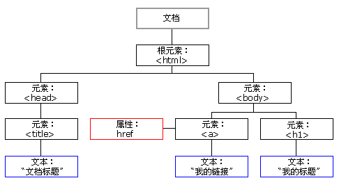

## 概述

DOM（Document Obejct Model）将 HTML/XML 文档抽象为一棵可编程的节点树，桥接文档结构与脚本行为，使页面内容可动态读取与更新
- 动态交互基础：脚本可增删改节点及其属性、样式，实时响应用户操作，构建单页应用和交互式体验
- 跨平台一致性：W3C 标准规范，各大浏览器实现同一模型，保障脚本一次编写、处处可用
- 分离关注点：将内容（HTML）、样式（CSS）与行为（JS）解耦，提升维护性与团队协作效率
- 内容与结构抽象：把标签、属性、文本都当作“节点”对象，统一接口，屏蔽底层解析差异
- 可扩展性：支持事件绑定、节点遍历和生命周期监控等高级功能，为现代框架（如 React/Vue）提供底层支撑

> BOM 专注于浏览器行为，而 DOM 专注于文档行为，实际上 DOM 属于 BOM

DOM 树
- 根节点（document）：代表整个 HTML 文档，是 DOM 树的最顶层节点，可通过 document.documentElement 访问 <html> 元素
- 元素节点（element）：对应每个 HTML 标签
- 属性节点（attribute）：每个元素的键值对属性
- 文本节点（text）：元素内的纯文本内容以及元素标签之间的空白字符（空格、制表符、换行符）
- 注释节点（comment）：对应 HTML 注释 \<!-- 注释内容 -->

## 获取元素

直接获取
- 按照 ID 获取：document.getElementById(id)，返回 Element 或 null，注意这里Element不是复数形式，因为 id 唯一
- 按照类名或许：document.getElementByClassName(className)，返回动态更新的 HTMLCollection
- 按照name属性获取：document.getElementByName(name)，返回静态的 NodeList
- 按照 HTML 标签名获取：document.getElementByTagName(tagName)，返回动态更新的 HTMLCollection

间接获取
- 根据子元素获取父元素：element.parentElement，返回一个 Element 或 null
- 根据父元素获取子元素集合：element.children，返回动态更新的 HTMLCollection
- 根据父元素获取第一个子元素：element.firstElementChild，返回 Element 或 null
- 根据父元素获取最后一个子元素：element.lastElementChild，返回 Element 或 null
- 根据当前元素获取前一个兄弟元素：element.previousElementSibling，返回 Element 或 null
- 根据当前元素获取后一个兄弟元素：element.nextElementSibling，返回 Element 或 null
- 根据当前元素获取所有子节点：element.childNodes，返回静态的 NodeList，这里不一定是元素节点

## 修改元素

内容修改
- 修改纯文本：element.textContent
- 修改子标签：element.innerHTML
- 修改属性：element.属性名
- 修改样式：element.style.样式名
- 插入元素
  - 添加到末尾：element.append(node)
  - 添加到开头：element.prepend(node)
  - 添加到某个子节点之前：element.insertBefore(newNode, referenceNode)
- 删除元素
  - 父节点指定移除子节点：element.removeChild(child)
  - 移除自己：element.remove()
- 替换元素
  - 父节点指定替换子节点：element.replaceChild(newNode, oldNode)
  - 替换自己：element.replaceWith(newNode)