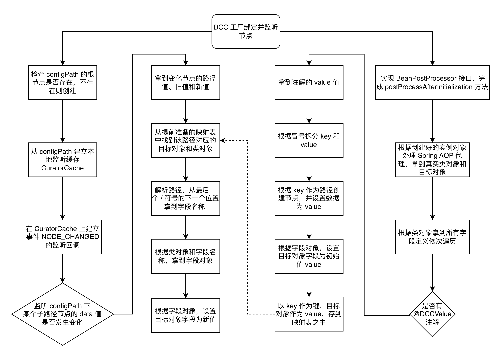
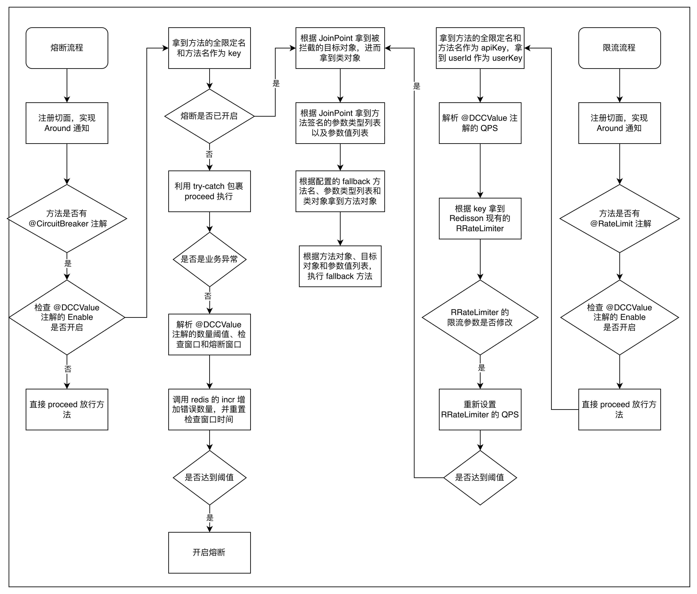
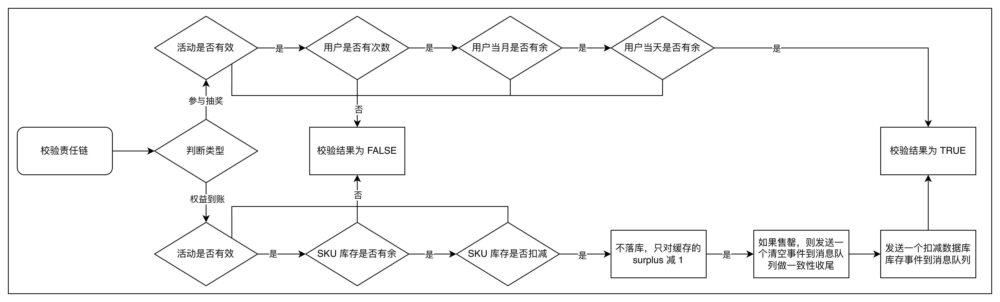
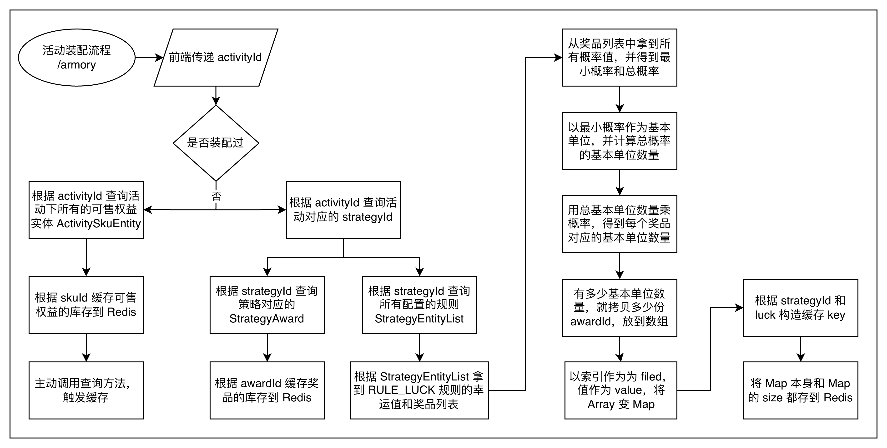
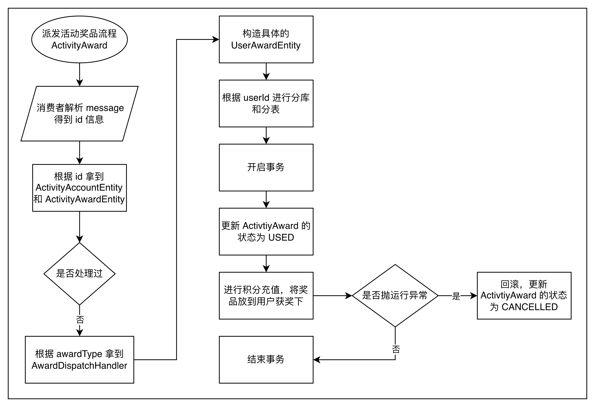
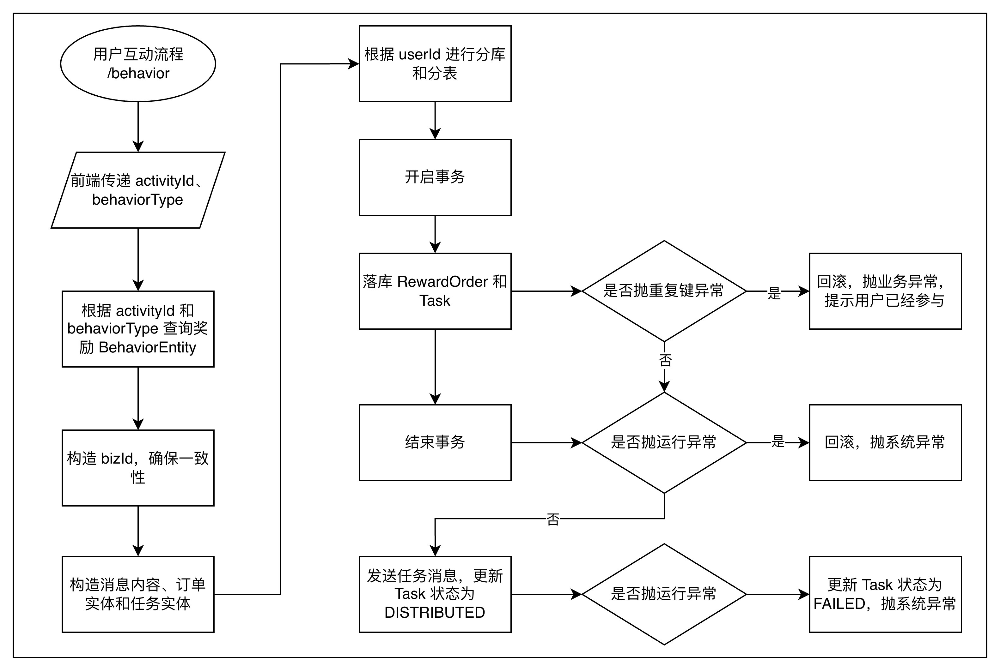
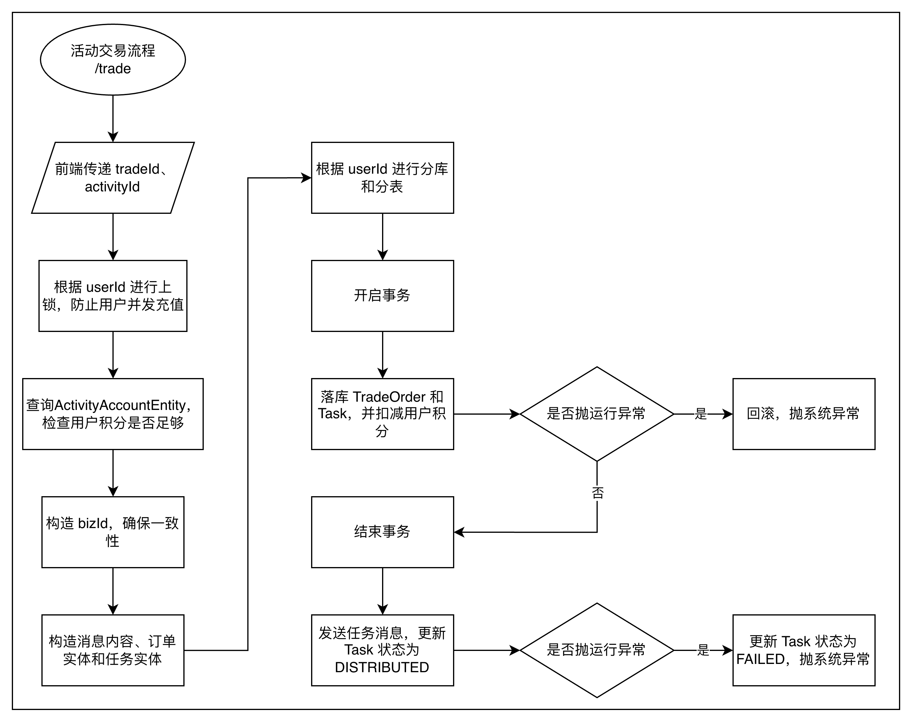

# 幸运抽奖

* [动态配置中心](#动态配置中心)
* [熔断限流](#熔断限流)
* [抽奖规则](#抽奖规则)
* [兑换责任链](#兑换责任链)
* [活动装配](#活动装配)
* [活动抽奖](#活动抽奖)
* [派发抽奖奖品](#派发抽奖奖品)
* [活动互动](#活动互动)
* [派发互动奖品](#派发互动奖品)
* [活动交易](#活动交易)
* [派发交易结果](#派发交易结果)

## 动态配置中心

主要利用了 ZooKeeper 和 Curator 去实现一个动态配置中心。

ZooKeeper 本质就是一个小型分布式文件系统，它利用了**树形结构**，每个节点可以保存少量关键数据，而分布式服务可以**共享读写**这些数据节点，并通过**监听+通知**机制来让分布式服务感知节点的数据变化，从而触发相应的**回调动作**。而 Curator 是 Java 操作 ZooKeeper 的**客户端**，CuratorFramework 类似 RedisTemplate 和 JdbcTemplate 那样，封装了操作 ZooKeeper 的函数。

在系统中，我通过 Docker 去启动了一个 ZooKeeper 服务，并创建一个配置类**实现 BeanPostProcessor 接口的 postProcessAfterInitialization 方法**：

1. 通过 AopUtils 拿到每个原始 Bean 对象，检查他们的字段上是否有自定义的 **@DCCValue** 注解
2. 如果有就可以拿到注解中的字段值，其中 path 是 ZooKeeper 的节点路径，而 init 就是节点初始值
3. 通过 CuratorFramework 挂载节点和初始值到 ZooKeeper 上
4. 在本地用一个 Map 保存了 path 到对象 bean 的映射

以上只是前置处理，相当于注册需要监听的字段到 ZooKeeper 上，接下来在这个配置类的构造函数之中通过 CuratorFramework 去创建一个 CuratorCache，再通过 CuratorCache 去创建一个 lisener：

1. ZooKeeperController 收到网络请求，利用 CuratorFramework 修改了某个路径下节点的数据
2. 当前节点的 CuratorFramework 收到 **NODE_CHANGE** 事件后发送给 CuratorCache 调用配置的监听器
3. 通过监听器可以拿到节点的路径值和新值，由于先前注册节点的时候记录了路径值到对象的映射关系，因此也就可以拿到对象
4. 在这里简单的让**节点名 = 字段名**，所以可以通过路径值解析得到字段名，从而通过类对象拿到字段对象
5. 最后通过反射可以更新对象的字段值为最新值，从而实现不同节点间的数据同步，完成动态配置

## 熔断限流

通过自定义的 **@CircuitBreaker 和 @RateLimit** 注解去标识方法是否需要熔断和限流，并且设置了 **fallback** 属性指定了方法所在类的失败回调函数名

通过自定义 **CircuitBreakerAspect 和 RateLimitAspect** 两个 **Around** 切面检测注解是否存在，从而执行熔断和限流逻辑，并且利用先前实现的 DCC 动态设置开关和阈值，如果是关的则直接放行。

- 熔断：根据方法签名 + 用户信息生成 key，在 Redis 中根据 key 拿到异常次数，如果异常次数超过阈值，则先通过 ProceedingJoinPoint 拿到对象和方法参数，然后通过注解中的回调方法名拿到方法对象，最后通过反射执行回调方法
- 限流：根据方法签名 + 用户信息生成 key，这里是直接基于 Redisson 的 **RRateLimiter**，设置好阈值后，通过 tryAcquire 判断是否过载，接着同样的先通过 ProceedingJoinPoint 拿到对象和方法参数，然后通过注解中的回调方法名拿到方法对象，最后通过反射执行回调方法

## 抽奖规则

1. 利用一个 RuleCheckContext 封装校验上下文，包括 userId 和 strategyId
2. 前置组装
    1. 通过 StrategyChainFactory 的构造器注入拿到所有 IStrategyChain 的实现类，根据注解中的 ruleModel 字符串放入 Map 建立映射关系
    2. 先用 strategyId 去查 StrategyEntity，然后拿到 ruleModels，最后按照顺序根据 ruleModel 字符串映射得到 StrategyChain 的实现类进行拼装
    3. 对外提供 getStrategyChain 返回工厂组装好的责任链
3. 前置规则
    1. 黑名单规则：ruleValue 格式为 awardId:blackIds，只要当前用户在 blackIds 里面，就返回 awardId
    2. 幸运值规则：ruleValue 格式为多组 luckThreshold:awardIds，找到当前用户的幸运值在哪个 luckThreshold 之中，然后在预先装配好的概率池中抽奖
    3. 默认规则：直接在预先装配好的概率池中抽奖
4. 通过前置逻辑后，拿到了 RuleCheckResult，包含 awardId 和最后命中的 ruleModel，如果命中了黑名单规则，则直接返回，否则还需要执行后置逻辑
5. 后置组装
    1. 通过 StrategyTreeFactory 的构造器注入拿到所有 IStrategyTree 的实现类，根据注解中的 ruleModel 字符串放入 Map 建立映射关系
    2. 先用 strategyId 和 awardId 去查 StrategyAwardEntity，然后拿到 treeId
    3. 根据 treeId 拿到所有的 RuleEdge，以 RuleNodeFrom 组装为 Map<RuleNode, List\<RuleEdge>>
    4. 根据 treeId 拿到所有的 RuleNode，映射到 List\<RuleEdge> 放入 RuleNode
    5. 以 RuleModel 组装为 Map<RuleModel, RuleNode>，最后将这个 ModelMap 放入 RuleTree 返回
    6. 对外提供 getStrategyEngine 返回工厂组装好的规则树引擎
6. 后置规则
    1. 锁规则：如果抽奖次数没有达标，则走库存规则，否则走兜底规则
    2. 库存规则；如果库存剩余不足，则走兜底规则，否则返回原奖品
    3. 兜底规则：返回配置的兜底奖品，可以确保库存充足
7. 通过后置逻辑后，拿到了新的 RuleCheckResult，包含是否命中 lock 和 stock，将前置逻辑的 awardId 作为实际抽到的 originalAwardId，将后置逻辑的 awardId 作为实际发放到 finalAwardId，返回给前端处理

## 兑换责任链

系统中用户可以**消耗次数执行抽奖**和**消耗积分兑换权益**，但是这里的权益和次数都是限量的，因此需要做一系列的前置检查

- 抽奖：判断活动是否有效 → 用户是否有次数 → 当月是否超额 → 当日是否超额
- 兑换：判断活动是否有效 → 是否有库存 → 是否扣减库存成功 → 不落库，只是将缓存的 surplus - 1，发送一个扣减数据库的消息到 Redis 的延迟队列

## 活动装配

根据 activityId 查询得到活动对应的策略 strategyId，进而查到所有 **StrategyAward** 和 **StrategyEntity**

1. 先将 StrategyAward 的库存放到 Redis 中，然后查看 StrategyEntity 是否包含 **RULE_LUCK** 规则，如果有的话就取出**积分阈值、奖品列表和每个奖品的概率值**。
2. 先计算得到最小概率和总概率，以最小概率作为基本单位，先用**【总概率 / 最小概率】**得到总基本单位数量，然后再用**【总基本单位数量 x 每个奖品的概率值】**得到每个奖品对应的基本单位数量
3. 将 awardId 复制基本单位数量份，全部汇总到一个 list 中并打乱，最后**将 list 的索引作为 field，对应的 awardId 作为 value，将 list 变为一个 map，再以积分阈值作为 Redis 的 key**，放到 Hash 结构中

抽奖就可以转换为随机取一个 size 大小内的数，去 hash 通过 O(1) 快速拿到 value，就是抽奖得到的 awardId

## 活动抽奖

利用分布式锁对 userId 进行上锁（防止并发抽奖），然后活动是否有效以及用户是否有抽奖次数，如果没问题则检查是否有还没完成的抽奖订单，如果存在则复用否则新建落库

前一步只是为了落库一个抽奖订单，下一步是去真的执行抽奖，也就是先前的抽奖规则，可以拿到返回的 awardId。为了提高并发性，并不会把 awardId 真的落库到用户仓库中，而是先落库 ActivtiyAward 中奖订单，再根据 awardId 和 userId 去构造一个分发用户抽奖奖品的消息，并封装为 Task 落库，最后将这个消息发送到消息队列中。

这里的 Task 是确保如果消息中途出现问题，系统的定时任务机制会扫描所有状态不是 SUCCESS 的任务，然后重新发送消息到对应的消息队列之中，所以 task 必须存储的信息至少有：处理状态 `task_state`、投递目标 `topic`、消息内容 `message` 、消息时间戳 `create_time`

## 派发抽奖奖品

## 活动互动

## 派发互动奖品

## 活动交易

## 派发交易结果

